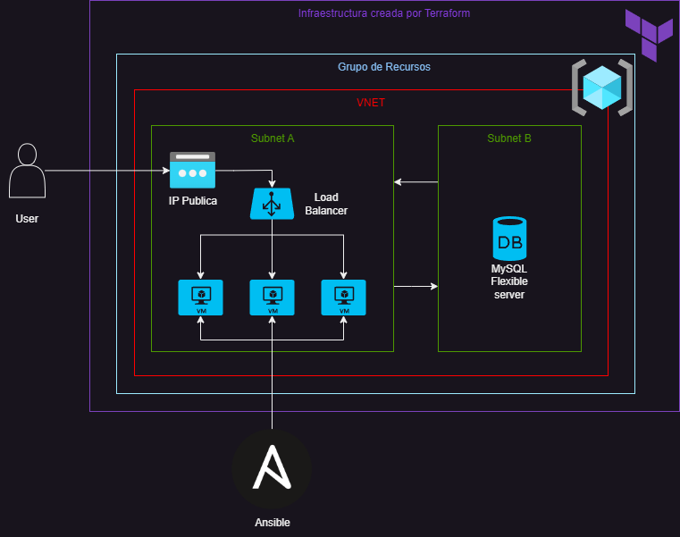
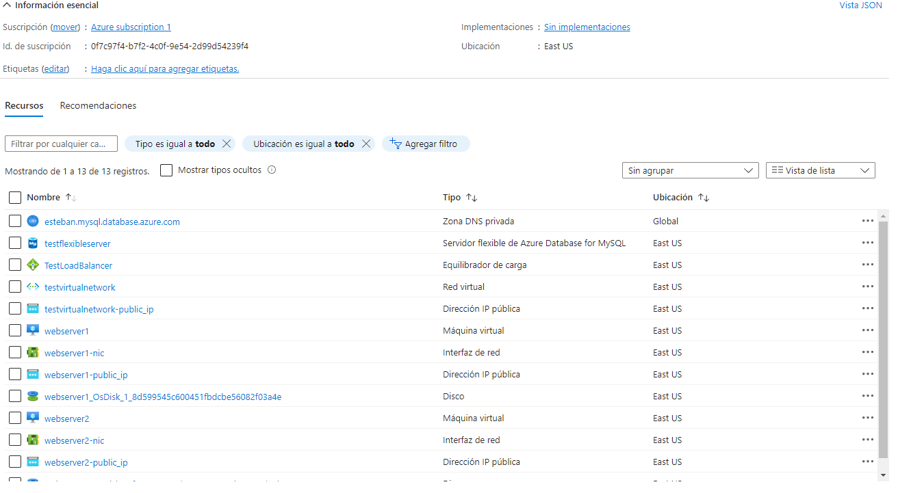

Proyecto del BootCamp Devops, en el cual se pide crear una infraestructura mediante Terraform para mantener Webservers y que estos sean administrados por ansible.
<p align="center">
                                           # Diagrama de la arquitectura
  
  
<p>

# Terraform
  
Lo primero que vamos a hacer es clonar el repositorio en nuestra maquina local con el comando:
  
Instalar git en tu dispositivo: 
  
```
git clone https://github.com/EstebanMengoni/Terraform-Azure-Ansible.git
```
Bien ahora necesitamos instalarnos el CLI de Azure y Terraform para poder deployar con Terraform la infraestructura en nuestra cuenta de Azure (Si lo tenes instalado podes saltear la primera parte)

Instalar Azure CLI en tu dispositivo: https://learn.microsoft.com/es-es/cli/azure/install-azure-cli
Instalar Terraform en tu dispositivo: https://developer.hashicorp.com/terraform/tutorials/aws-get-started/install-cli
  
Una vez instalados procederemos a loguearnos en azure usando:
  
```
az login
```
  
Ya logueados en nuestra cuenta nos posicionaremos en la carpeta del repositorio, para despues ejecutar el siguientes comandos:
> El tercer webserver esta comentado ya que se necesita una suscripcion que permita mas ips publicas, como free trial no lo permite, el 3er webserver esta comentado, si lo queres usar, tenes que descomentar el modulo en el main.tf y su ip publica en la pool del loadbalancer, todo esto antes de usar los comandos.
  
```
terraform init
```
```
terraform apply
```
Bien, ya tenemos la infraestructura, tendriamos que tener en nuestro portal de Azure un grupo de recursos con el nombre que elegimos y todos sus recursos:

Portal de Azure: https://portal.azure.com/#home

  
  
# Ansible
  
Ahora es el turno de Ansible, una vez creada la infraestructura, debemos entrar en los webservers desde nuestro portal de Azure y buscar la ip publica de estos. Con la ip publica lo que haremos sera pegarla en el archivo llamado 'inventory.ini' en el apartado de webservers, todas las ips publicas de nuestros webservers, una abajo de la otra.
> Esto se intento automatizar, pero no se encontro la forma, tambien se intento agilizar con el output de Terraform, pero por alguna razon el output la primera vez que se ejecuta terraform apply devuelve una cadena vacia, por lo tanto se tuvo que optar por esta opcion.
  

  
  
  
Una vez hecho esto parados en la carpeta del repositorio, procederemos a instalar Apache2 y PHP en nuestros webservers, para eso utilizaremos el siguiente comando de Ansible:

```
ansible-playbook -i inventory.ini playbook.yml
```


