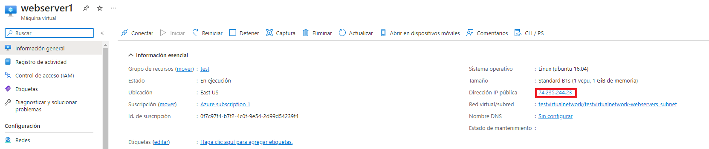
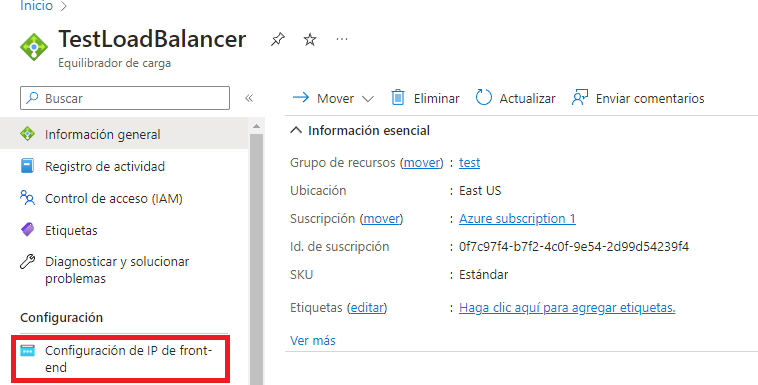
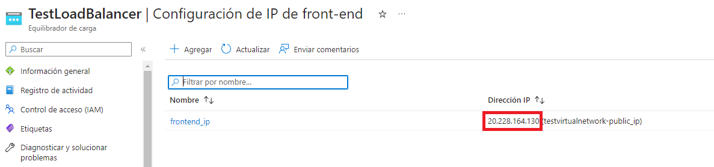

Proyecto del BootCamp Devops, en el cual se pide crear una infraestructura mediante Terraform para mantener Webservers y que estos sean administrados por Ansible.
<p align="center">
                                           # Diagrama de la arquitectura
  
  
<p>

# Terraform
  
Lo primero que vamos a hacer es clonar el repositorio en nuestra maquina local con el comando:
  
Instalar git en tu dispositivo: 
  
```
git clone https://github.com/EstebanMengoni/Terraform-Azure-Ansible.git
```
Bien ahora necesitamos instalarnos el CLI de Azure y Terraform para poder deployar con Terraform la infraestructura en nuestra cuenta de Azure (Si lo tenes instalado podes saltear la primera parte)

Instalar Azure CLI en tu dispositivo: https://learn.microsoft.com/es-es/cli/azure/install-azure-cli.
Instalar Terraform en tu dispositivo: https://developer.hashicorp.com/terraform/tutorials/aws-get-started/install-cli.
  
Una vez instalados procederemos a loguearnos en azure usando:
  
```
az login
```
  
Ya logueados en nuestra cuenta nos posicionaremos en la carpeta del repositorio, para despues ejecutar el siguientes comandos:
> El tercer webserver esta comentado ya que se necesita una suscripcion que permita mas ips publicas, como free trial no lo permite, el 3er webserver esta comentado, si lo queres usar, tenes que descomentar el modulo en el main.tf y su ip publica en la pool del loadbalancer, todo esto antes de usar los comandos.
  
```
terraform init
```
```
terraform apply
```
Bien, ya tenemos la infraestructura, tendriamos que tener en nuestro portal de Azure un grupo de recursos con el nombre que elegimos y todos sus recursos:

Portal de Azure: https://portal.azure.com/#home

  
  
# Ansible
  
Ahora es el turno de Ansible, una vez creada la infraestructura, el output de Terraform nos dara las ip publicas que necesitamos para que Asible se conecte, tambien podrias entrar en los webservers desde el portal de Azure y buscar la ip publica de estos. Con la ip publica lo que haremos sera pegarla en el archivo llamado `inventory.ini` en el apartado de webservers, todas las ips publicas de nuestros webservers, una abajo de la otra.
> Esto se intento automatizar, pero no se encontro la forma, que no sea con jenkins.
  
  
  
  
  
Si no para ver la ip desde el output de Terraform de nuevo, podes utilizar el siguiente comando:
```  
terraform output
```
  
Una vez hecho esto, parados en la carpeta del repositorio, procederemos a instalar Apache2 y PHP en nuestros webservers, para eso utilizaremos el siguiente comando de Ansible:

```
ansible-playbook -i inventory.ini playbook.yml
```
  

Y listo! Una vez hecho esto vamos a tener en nuestros webservers instalados Apache2 y PHP, para ver los resultados tienes que ir a tu portal de Azure, ingresar al loadbalancer, ingresar el frontend ip y pegar la ip en tu buscador.
  
  
  

Ahora solo faltaria una tarea programada que ejecute el playbook para mantener actualizado el Apache2 y el PHP, para eso deberas pegar el siguiente codigo en tu crontab si gustas.

```
0 3 * * * cd /ruta/a/la/carpeta/del/repositorio && ansible-playbook -i inventory.ini playbook.yml
```
Ahora abriremos crontab y pegaremos el codigo anterior en el:
```
crontab -e
```

Friendly reminder: Si se quiere eliminar la infraestructura, siempre hacerlo con `terraform destroy`, nunca eliminarla desde el portal de Azure, ya que Terraform guarda el estado de la infra, si este difiere del estado del portal, puede llegar a generar problemas a la hora de querer aplicar otro apply o destroy.

Fin del Proyecto, muchas gracias por haber llegado hasta aca!
